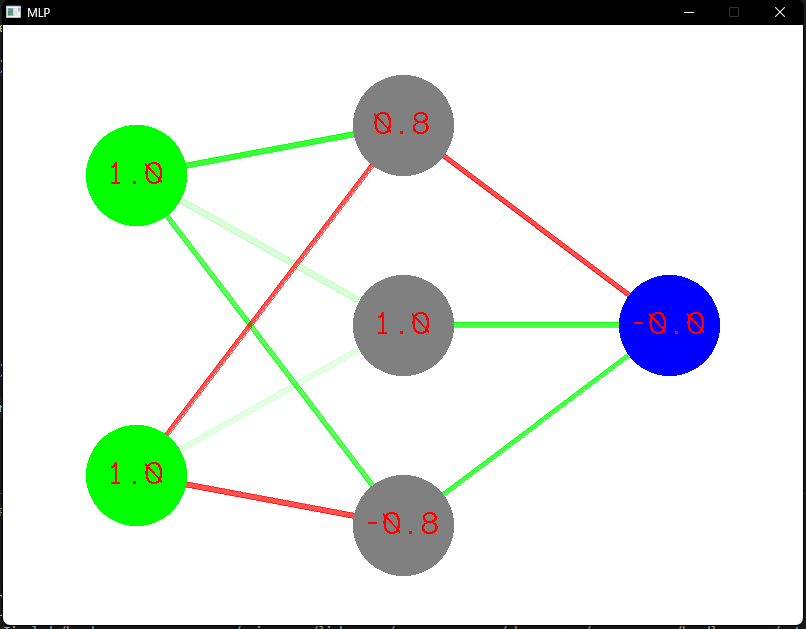
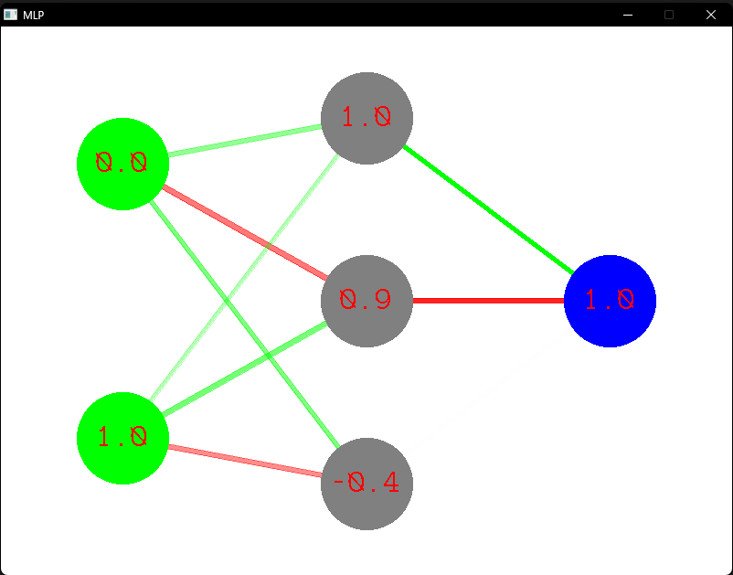

# simple neural network
This is my first real implementation of the neural network. So much fun!

The XOR problem was chosen, because it's the simplest introduction to the MLP concept. I got the whole theory behind it from [here](docs/goodsource.pdf), where XOR was shown as the standard example of MLP implementation.

I decided to use SDL with C++, because ~~I like suffering~~ it wanted to try something new as well. ~~...Aand I got over-C-ed during my univeristy course 😊~~.

# Background

MLP (<b>m</b>ulti<b>l</b>ayer <b>p</b>erceptron) is 

The whole network contains an input layer, a hidden layer (modifiable) and an output layer. The hidden layer contains neurons that implement the McCulloch-Pitts mathematical model.

Each neuron in the non-input layers has an "activation function". I chose the tanh function because its values are symmetrical around 0 --- I noticed that the training doesn't converge to 0.5 all the time, as it did with the sigmoid function.

Training starts with **forward propagation** (also known as feed-forward). It goes through the entire network, calculating the values of the new neurons, with randomly generated weights between them, to reach the output layer. Then the error is calculated (result in the output layer minus the expected output set) and then the **backward propagation** through the network happens: the weights are adjusted accordingly. After a bunch of tests, the network correctly "guesses" the correct result.

I added bias neurons to each layer to shift the values to better fit the network to the training data.

# How to run?
```
git clone https://github.com/dziobex/simple-neural-network.git
cd simple-neural-network
mingw32-make
./neuro
```

# Preview
## 1 &oplus; 1

```
./neuro     
Resourcer is being created.
Tests in total: 87
0.0 xor 1.0 = 1.0
0.0 xor 0.0 = 0.0
1.0 xor 0.0 = 1.0
1.0 xor 1.0 = 0.0
HANDLER is being destroyed
Resourcer is being destroyed.
```
## 0 &oplus; 1

```
./neuro     
Resourcer is being created.
Tests in total: 115
1.0 xor 1.0 = 0.0
1.0 xor 0.0 = 1.0
0.0 xor 0.0 = 0.0
0.0 xor 1.0 = 1.0
HANDLER is being destroyed
Resourcer is being destroyed.
```

# Sources!
* https://home.agh.edu.pl/~horzyk/lectures/miw/MIW-SztuczneSieciNeuronoweMLP.pdf
* http://galaxy.agh.edu.pl/~vlsi/AI/bias/bias.html
* https://www.youtube.com/watch?v=-7scQpJT7uo